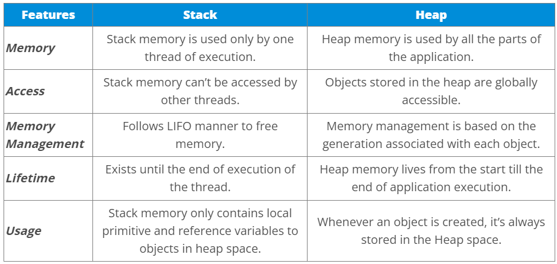

Stack is a fixed, finite-size memory area allocated separately for each
program. The heap, on the other hand, dynamically adapts to the needs of
the program, and in the case of Java, its max size is adjustable.
(Nowadays, on a modern OS the theoretical limit is set by the length of
the virtual memory address. E.g. 32 bits -- 4GB).

{}