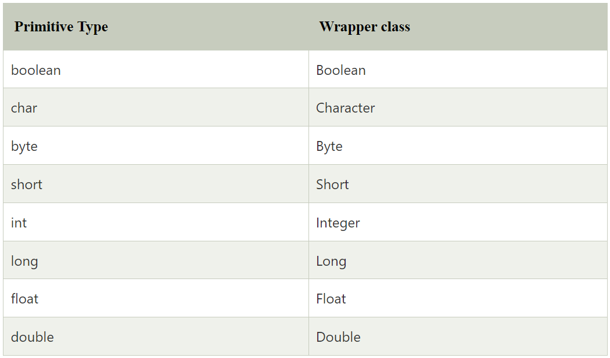

Wrapper classes are classes that allow primitive types to be accessed as
objects. In other words, we can say that wrapper classes are built-in
java classes which allow the conversion of objects to primitives and
primitives to objects. The process of converting primitives to objects
is called autoboxing, and the process of converting objects to
primitives is called unboxing. There are eight wrapper classes present
in java.lang package is given below.

{}