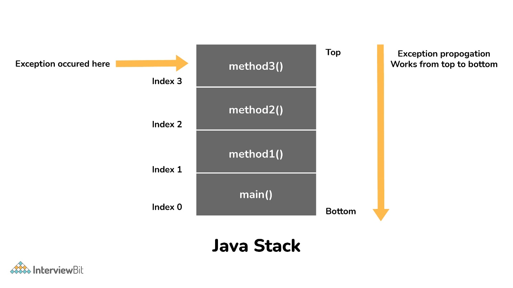

An Exception handling in Java is considered an unexpected event that can
disrupt the program's normal flow. These events can be fixed through
the process of Exception Handling.

An exception happens on the top level of the call stack, and it stops
the running of the code. The JVM then starts to look in the call stack
for the highest try-catch block with a compatible catch branch (same or
ancestor class of the exception), and executes it. If no such block
exists, the program crashes.

{}

An exception is first thrown from the top of the stack and if it is not
caught, it drops down the call stack to the previous method, If not
caught there, the exception again drops down to the previous method, and
so on until they are caught or until they reach the very bottom of the
call stack. This procedure is called exception propagation. By default,
checked exceptions are not propagated.

class TestExceptionPropagation1 {

> void m() {

> > int data = 50 / 0;

> }

> void n() {

> > m();

> }

> void p() {

> > try {

> > > n();

> > } catch (Exception e) {

> > > System.out.println(\"exception handled\");

> > }

> }

> public static void main(String args\[\]) {

> > TestExceptionPropagation1 obj = new TestExceptionPropagation1();

> > obj.p();

> > System.out.println(\"normal flow\...\");

> }

}

Output:

exception handled

normal flow\...

{}