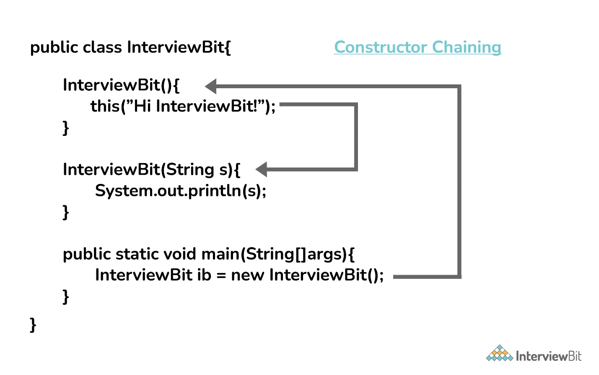

Yes, the concept can be termed as constructor chaining and can be
achieved using this().

{}

From the base class: The super() keyword is used to call the constructor
from the base class.

The constructor chaining follows the process of inheritance. The
constructor of the sub class first calls the constructor of the super
class. Due to this, the creation of sub class's object starts with the
initialization of the data members of the super class. The constructor
chaining works similarly with any number of classes. Every constructor
keeps calling the chain till the top of the chain.