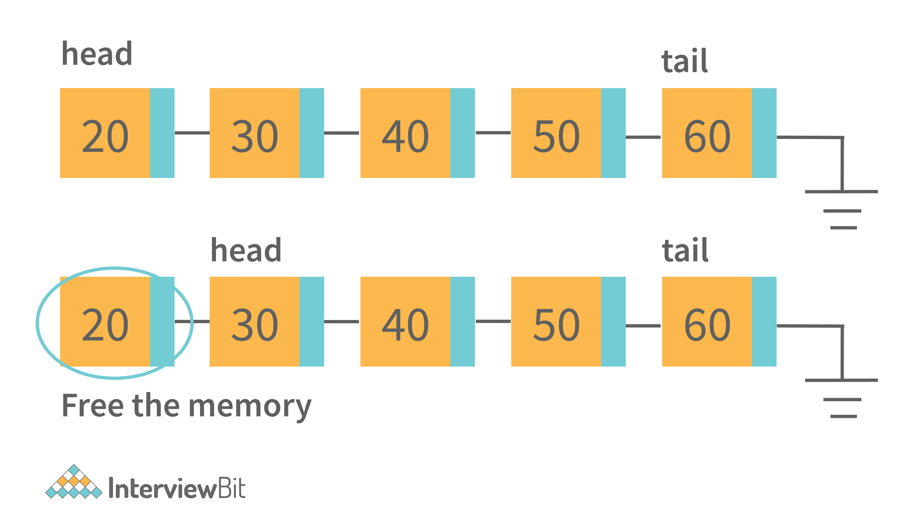
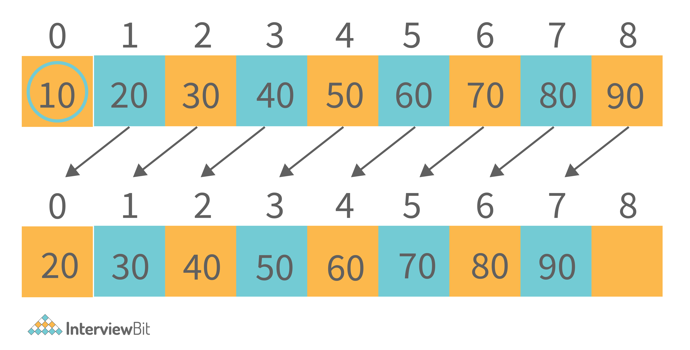

Because less operations have to be performed. In an array, when deleting
an item, all the following items have to be shifted by one to the
direction of the beginning in the array. In a linked list only the
neighboring elements have to be updated, more precisely their reference
to the previous and next element.

In the linked list, we only need to adjust the references when we want
to delete the element from either end or the front of the linked list.
But in the array, indexes are used. So to manage proper indexing, we
need to adjust the values from the array So this adjustment of value is
costlier than the adjustment of references.

Example: To Delete from the front of the linked list, internally the
references adjustments happened like this.

{}

The only thing that will change is that the head pointer will point to
the head's next node. And delete the previous node. That is the constant
time operation.

Whereas in the ArrayList, internally it should work like this:

{}

For deletion of the first element, all the next element has to move to
one place ahead. So this copying value takes time. So that is the reason
why removing in ArrayList is slower than LinkedList.