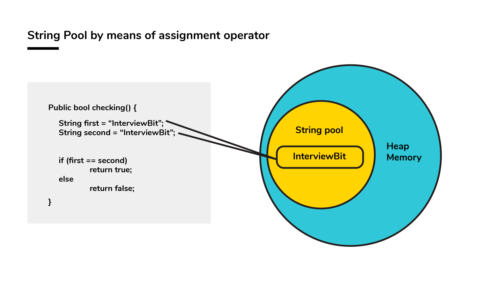
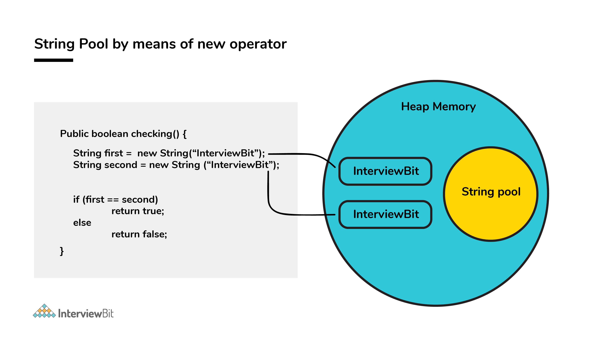

When a String is formed as a literal with the assistance of an
assignment operator, it makes its way into the String constant pool so
that String Interning can take place. This same object in the heap will
be referenced by a different String if the content is the same for both
of them.

public bool checking() {

> String first = \"InterviewBit\";

> String second = \"InterviewBit\";

> if (first == second)

> > return true;

> else

> > return false;

}

The checking() function will return true as the same content is
referenced by both the variables.

{}

Conversely, when a String formation takes place with the help of a new()
operator, interning does not take place. The object gets created in the
heap memory even if the same content object is present.

public bool checking() {

> String first = new String(\"InterviewBit\");

> String second = new String(\"InterviewBit\");

> if (first == second)

> > return true;

> else

> > return false;

}

The checking() function will return false as the same content is not
referenced by both the variables.

{}