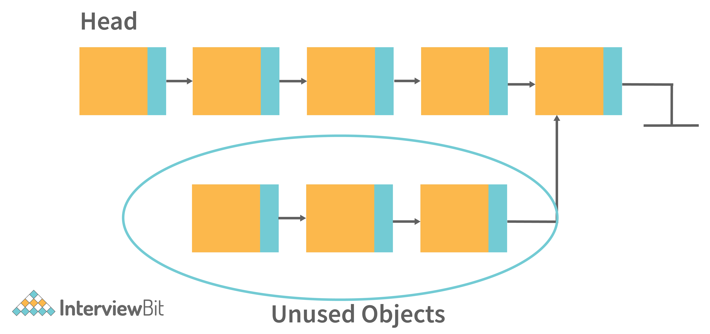

The Java Garbage Collector (GC) typically removes unused objects when
they are no longer required, but when they are still referenced, the
unused objects cannot be removed. So this causes the memory leak
problem. Example: Consider a linked list like the structure below:

{}

In the above image, there are unused objects that are not referenced.
But then also Garbage collection will not free it. Because it is
referencing some existing referenced object. So this can be the
situation of memory leak.

Some common causes of Memory leaks are -

- When there are Unbounded caches.

- Excessive page swapping is done by the operating system.

- Improper written custom data structures.

- Inserting into a collection object without first deleting it.

- etc.