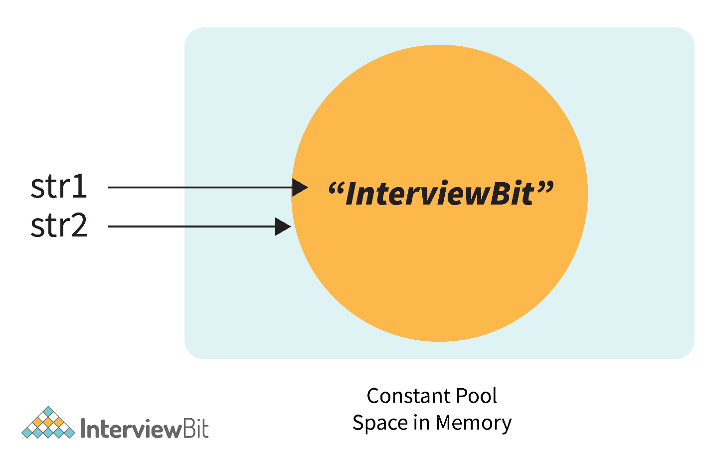
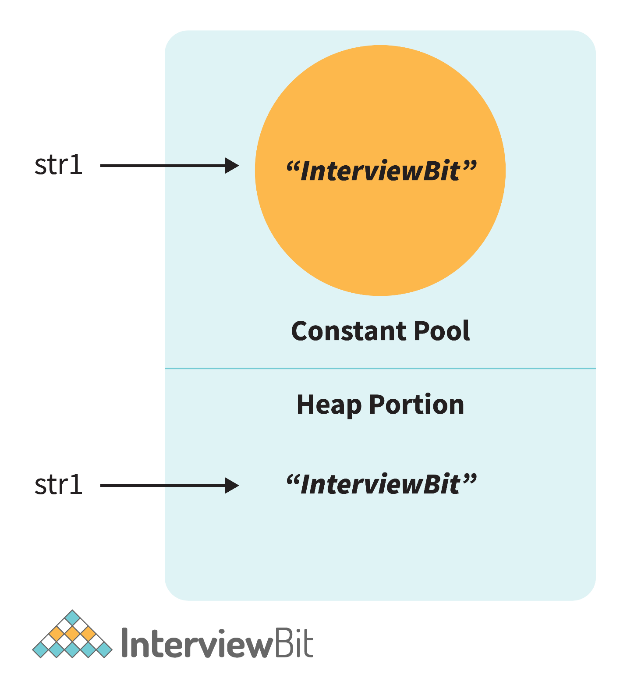
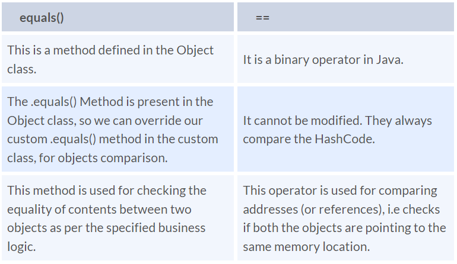

In the case of objects, == checks the memory reference, while equals()
checks the value/contenth of the objects. In order to understand this
better, let's consider this with the example:

String str1 = \"InterviewBit\";

String str2 = \"InterviewBit\";

System.out.println(str1 == str2);

This code will print true. We know that both strings are equals so it
will print true. But here (==) Operators don't compare each character in
this case. It compares the memory location. And because the string uses
the constant pool for storing the values in the memory, both str1 and
str2 are stored at the same memory location.

{}

Now, if we modify the program a little bit with:

String str1 = new String(\"InterviewBit\");

String str2 = \"InterviewBit\";

System.out.println(str1 == str2);

{}

Then in this case, it will print false. Because here no longer the
constant pool concepts are used. Here, new memory is allocated. So here
the memory address is different, therefore ( == ) Operator returns
false. But the twist is that the values are the same in both strings. So
how to compare the values? Here the .equals() method is used.

.equals() method compares the values and returns the result accordingly.
If we modify the above code with:

System.out.println(str1.equals(str2));

Then it returns true.

{}

Note:

- In the cases where the equals method is not overridden in a class,
  then the class uses the default implementation of the equals method
  that is closest to the parent class.

- Object class is considered as the parent class of all the java
  classes. The implementation of the equals method in the Object class
  uses the == operator to compare two objects. This default
  implementation can be overridden as per the business logic.