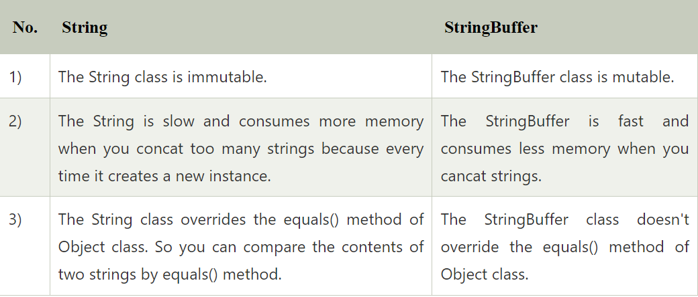
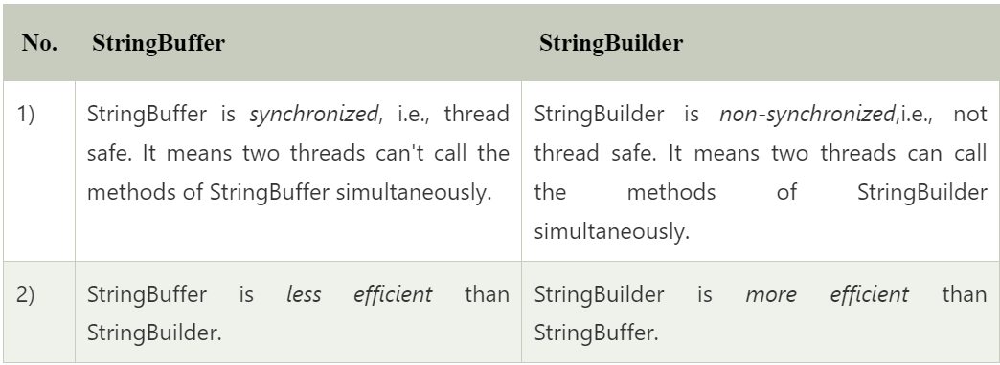
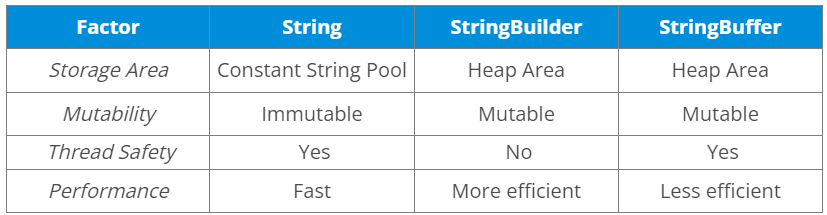

The String class is immutable, whereas the other two are mutable in
nature. StringBuffer is synchronous, meaning it is thread-safe, whereas
StringBuilder is asynchronous, which means it is not thread-safe. String
uses the string pool as memory storage for string literals, whereas the
other two use the heap memory for storage purposes. StringBuilder is the
fastest in performing operations. The speed of a StringBuffer is more
than a String and less than a StringBuilder. (For example appending a
character is fastest in StringBuilder and very slow in String because a
new memory is required for the new String with appended character.)

{}

{}

{}