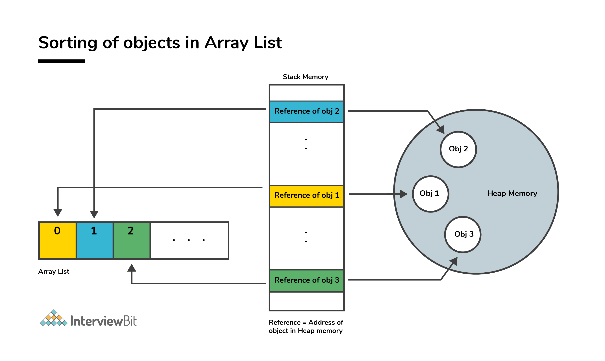
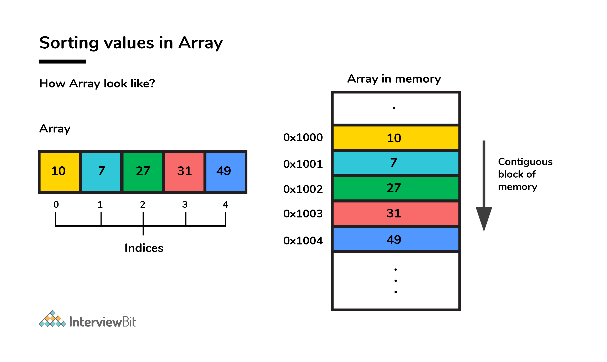

In the case of ArrayList, data storing in the form of primitive data
types (like int, float, etc.) is not possible. The data members/objects
present in the ArrayList have references to the objects which are
located at various sites in the memory. Thus, storing of actual objects
or non-primitive data types (like Integer, Double, etc.) takes place in
various memory locations.

{}

However, the same does not apply to the arrays. Object or primitive type
values can be stored in arrays in contiguous memory locations, hence
every element does not require any reference to the next element.

{}