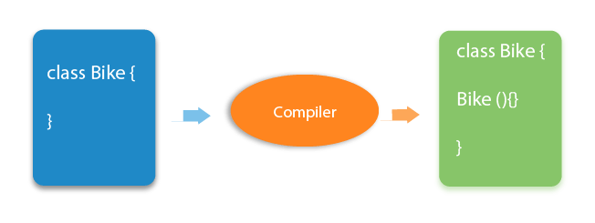

The purpose of the default constructor is to assign the default value to
the objects. The java compiler creates a default constructor implicitly
if there is no constructor in the class.

class Student3 {

> int id;

> String name;

> void display() {

> > System.out.println(id+\" \"+name);

> }

> public static void main(String args\[\]) {

> > Student3 s1=new Student3();

> > Student3 s2=new Student3();

> > s1.display();

> > s2.display();

> }

}

Output:

0 null

0 null

Explanation: In the above class, you are not creating any constructor,
so compiler provides you a default constructor. Here 0 and null values
are provided by default constructor.

{}