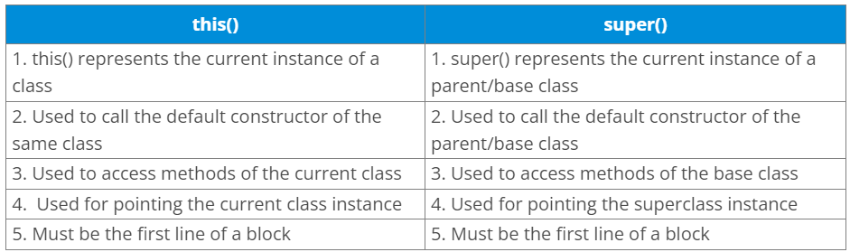

There are the following differences between this and super keyword.

- The super keyword always points to the parent class contexts whereas
  this keyword always points to the current class context.

- The super keyword is primarily used for initializing the base class
  variables within the derived class constructor whereas this keyword
  primarily used to differentiate between local and instance variables
  when passed in the class constructor.

- The super and this must be the first statement inside constructor
  otherwise the compiler will throw an error.

{}