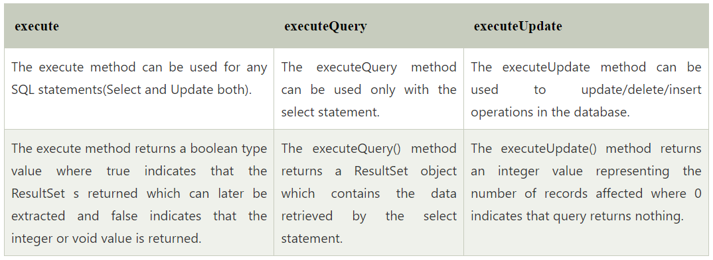

{}

- Statement execute(String query) is used to execute any SQL query and
  it returns TRUE if the result is an ResultSet such as running Select
  queries. The output is FALSE when there is no ResultSet object such
  as running Insert or Update queries. We can use getResultSet() to
  get the ResultSet and getUpdateCount() method to retrieve the update
  count.

- Statement executeQuery(String query) is used to execute Select
  queries and returns the ResultSet. ResultSet returned is never null
  even if there are no records matching the query. When executing
  select queries we should use executeQuery method so that if someone
  tries to execute insert/update statement it will throw
  java.sql.SQLException with message "executeQuery method can not be
  used for update".

- Statement executeUpdate(String query) is used to execute
  Insert/Update/Delete (DML) statements or DDL statements that returns
  nothing. The output is int and equals to the row count for SQL Data
  Manipulation Language (DML) statements. For DDL statements, the
  output is 0.

You should use execute() method only when you are not sure about the
type of statement else use executeQuery or executeUpdate method.