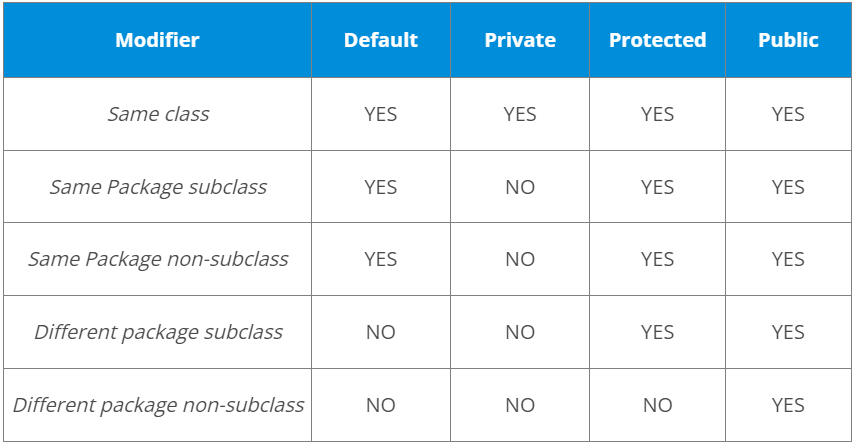

In Java, access modifiers are special keywords which are used to
restrict the access of a class, constructor, data member and method in
another class. Java supports four types of access modifiers:

- Default

- Private

- Protected

- Public

{}