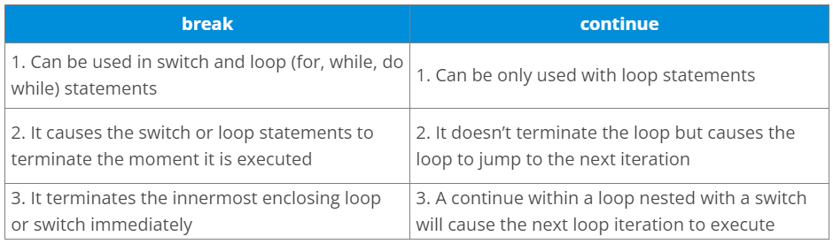

{}

Example break:

for (int i = 0; i \< 5; i++) {

> if (i == 3) {

> > break;

> }

> System.out.println(i);

}

Example continue:

for (int i = 0; i \< 5; i++) {

> if (i == 2) {

> > continue;

> }

> System.out.println(i);

}