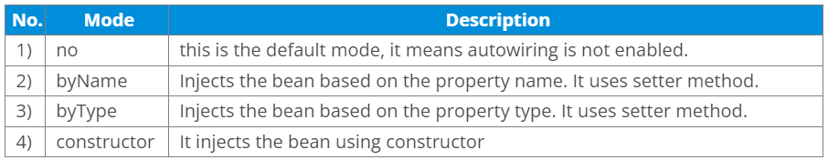

Autowiring enables the programmer to inject the bean automatically. We
don't need to write explicit injection logic. Let's see the code to
inject bean using dependency injection.

- \<bean id="emp" class="com.javatpoint.Employee" autowire="byName"
  /\>

The autowiring modes are given below:

{}