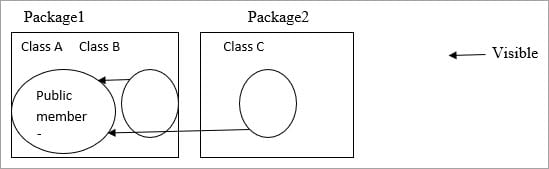
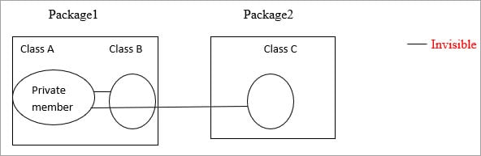

Methods and instance variables are known as members.

Public:

Public members are visible in the same package as well as the outside
package that is for other packages.

{}

Public members of Class A are visible to Class B (same package) as well
as Class C (different packages).

Private:

Private members are visible in the same class only and not for the other
classes in the same package as well as classes in the outside packages.

{}

Private members in class A are visible only in that class. It is
invisible for class B as well as class C.