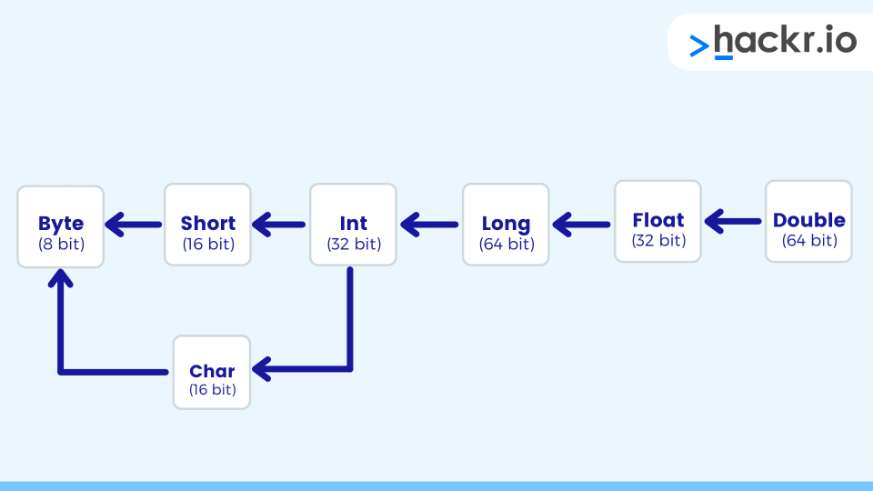

{}

The different types of typecasting are:

- Implicit: Storing values from a smaller data type to the larger data
  type. It is automatically done by the compiler.

- Explicit: Storing the value of a larger data type into a smaller
  data type. This results in information loss:

- Truncation:While converting a value from a larger data type to a
  smaller data type, the extra data will be truncated. This code
  example explains it :

> float f = 3.14f;
>
> int i = (int) f;

After execution, the variable i will contain only 3 and not the decimal
portion.

- Out of Range:Typecasting does not allow assigning value more than
  its range; if that happens then the data is lost in such cases. This
  code example explains it:

long l = 123456789;

byte b = (byte) l; // byte is of not the same range as long so there
will be loss of data.