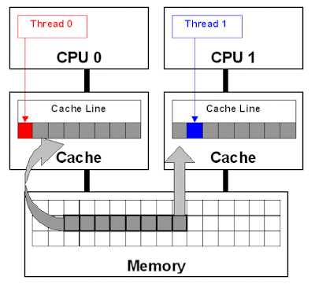

false sharing is one of the well-known performance issues on multi-core
systems, where each process has its local cache. false sharing occurs
when threads on different processor modify variables that reside on same
cache line as shown in the following image:

{}

False sharing is very hard to detect because the thread may be accessing
completely different global variables that happen to be relatively close
together in memory. Like many concurrency issues, the primary way to
avoid false sharing is careful code review and aligning your data
structure with the size of a cache line.